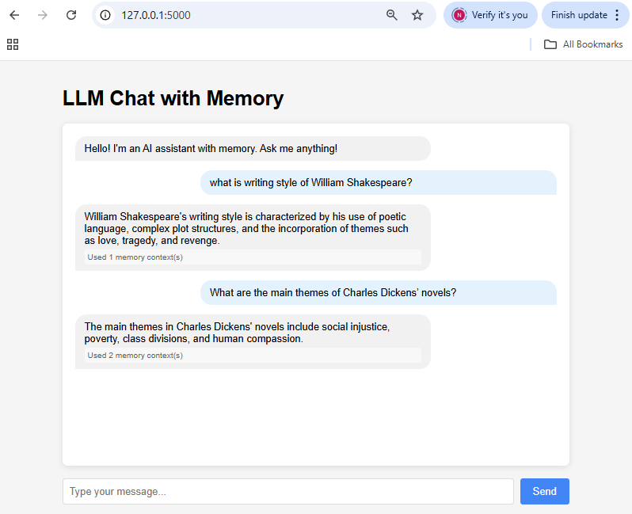
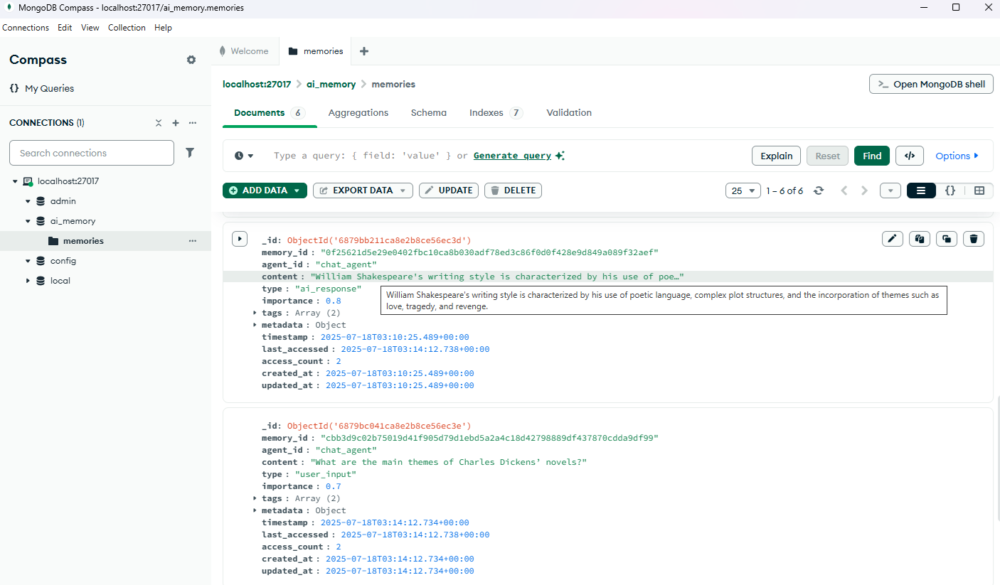
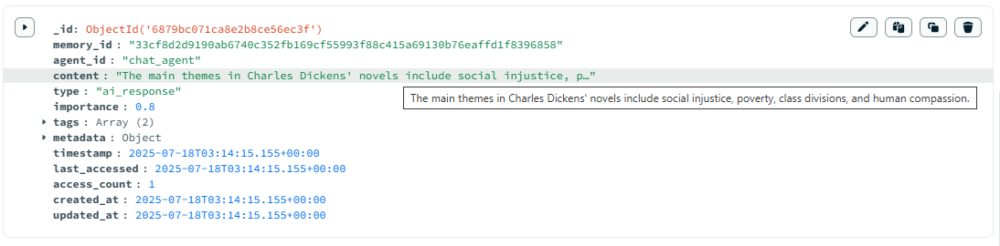

# LLM Chat with Memory

A chatbot web application with long-term memory capabilities using MongoDB. Persistently stores conversations with optimized retrieval using indexes on agent_id, timestamp, and tags. Removes duplicate sentences and combines recency with importance for smart memory retrieval.

## Screenshots

### Web Application Interface


### MongoDB Compass - Memories Collection  


### MongoDB Document Details


---

## How to Run

| Requirement | Details |
|-------------|---------|
| **Python** | Flask |
| **Database** | MongoDB (`mongodb://localhost:27017`) |
| **AI Libraries** | Hugging Face transformers + PyTorch |

```bash
# Start Flask app
python app.py

# Access chat UI at http://localhost:5000

# (Optional) Inspect memories
python inspect_memories.py
```

---

## Workflow

| Step | Action |
|------|--------|
| 1 | User sends message → Stored in MongoDB |
| 2 | System retrieves relevant memories |
| 3 | LLM generates response using prompt + context |
| 4 | AI response stored in memory |
| 5 | Response displayed in chat UI |

---

## Core Components

### Flask Web Application (`app.py`)
- Routes: `/` (chat interface), `/chat` (POST - processes messages)
- Handles HTTP requests/responses

### AI Model (Microsoft Phi-2)
- Uses Hugging Face transformers
- Parameters: `temperature=0.7`, `top_k=50`, `repetition_penalty=1.2`

### Long-Term Memory System
- **Storage**: MongoDB for persistent conversations
- **Features**: Memory indexing, deduplication, relevance scoring
- **Tracking**: last_accessed, access_count, updated_at

### Memory Inspection (`inspect_memories.py`)
- Counts total memories, user inputs, AI responses
- Displays latest 3 memories with timestamps and importance

---

## Key Features

- **Memory-Augmented Chat**: Stores user messages and AI responses
- **Smart Retrieval**: Text search + regex fallback with recency/importance weighting
- **Web Interface**: Chat bubbles, context usage indicators, real-time messaging
